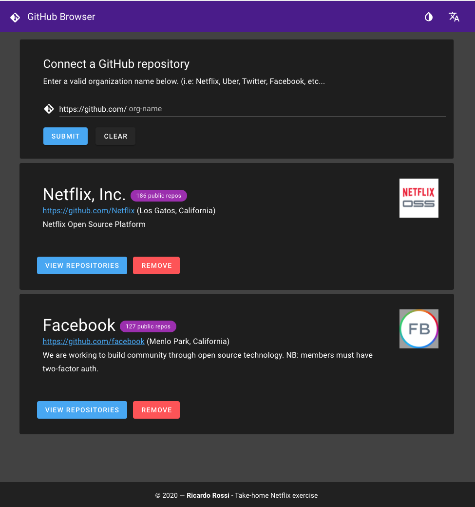
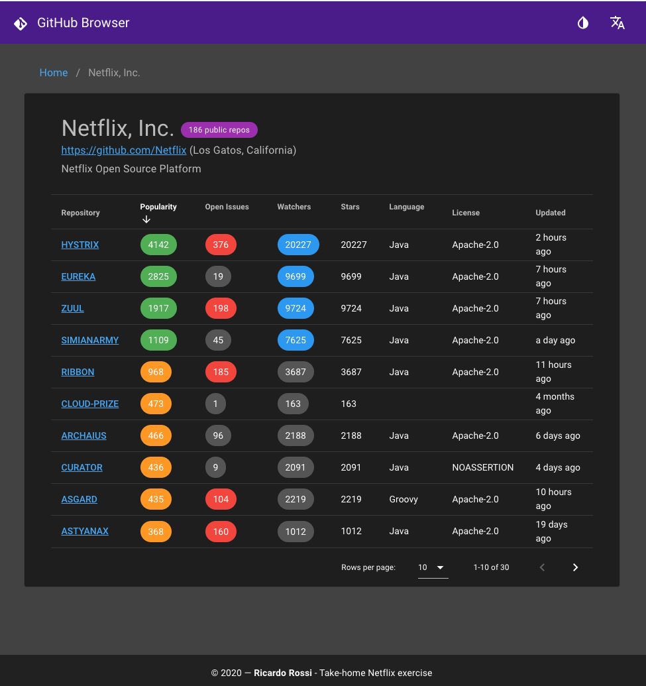
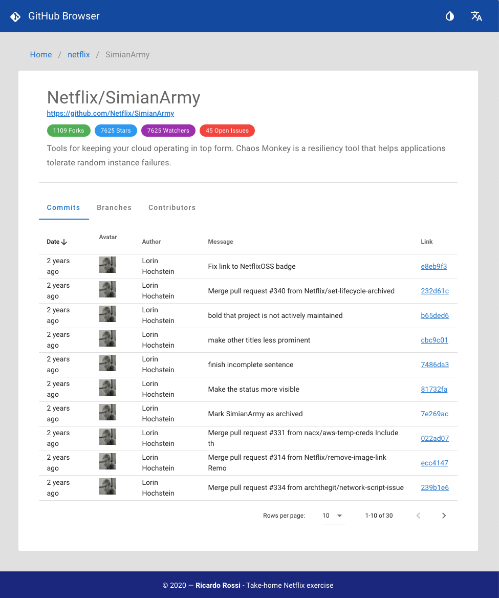
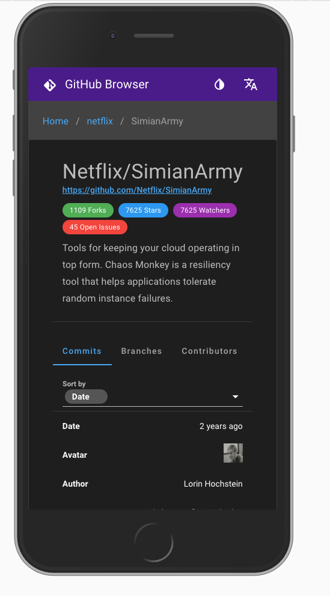

# GitHub Browser (take-home assignment)

# Overview

## Functional Requirements

> Take-Home Exercise:
  Build a simple interactive UI to display a list of an arbitrary user-specified organization's GitHub projects ranked by any meaningful metric you'd like, and allow the user to browse recent commits on that project.
  
>  For instance, one metric could be popularity, which could be derived via the number of forks. In this case, the UI would list Netflix's public repositories with Hystrix on top, followed by SimianArmy, followed by eureka, etc. GitHub offers an intuitive RESTful API to do this.
  
>  You can use any web framework you'd like; please provide instructions on how to build and run your web app.
 
>  If you normally develop with automated tests, please include them; otherwise please include a short list of manual tests. 

>  In terms of level of effort and prioritization around code elegance, presentation polish, and UI/UX thoughtfulness, we expect this will take no more than about five hours, depending on how much work you want to put into it.  Think of this as "I need to put something up that my users will actually be using on a daily basis, but I don't have days and days to work on it" as a general way to think about your final product. We don't expect you to give us something back within a day – we know, and appreciate the fact you've got a busy life and a job.  

## Screenshots

#### Supports adding multiple GitHub organizations


#### Sortable repos KPIs 


#### Dark/Light themes


#### The entire app designed and optimized for mobile


# Live Demo

[http://github-popularity.s3-website-us-west-1.amazonaws.com/](http://github-popularity.s3-website-us-west-1.amazonaws.com/)

# Installation and Setup

## Dependencies 

* Node v12+  

## Project setup
```
npm install
```

### Compiles and hot-reloads for development
```
npm run serve
```

### Compiles and minifies for production
```
npm run build
```

### Lints and fixes files
```
npm run lint
```

### Run Tests
```
npm run test
```

### Manual test cases:

Adding an organization

- 1.1 Happy path:
  - Enter Netflix as the organization name
  - Hit the Summit button
  - Verify Netflix shows up in the org list
- 1.2 Invalid organization name
  - Enter the SAHSJAHSAHSLKA org name 
  - Hit the Submit button
  - Verify the alert message indicates the org was not found
 
Removing an organization
- Follow 1.1 above to add an org
- Click the Remove button next to the org
- Verify the org as removed

Viewing organization repositories
- Follow 1.1 above to add an org
- Click the View Repositories button
- Verify the repository list is shown

View repository details
- Follow 1.1 above to add an org
- Click the View Repositories button
- Select a repository
- Verify you can see the commits list
- Click on the Branches tab
- Verify you can see the branches list
- Click on the Contributors tab
- Verify you can see the contributors list

 
 